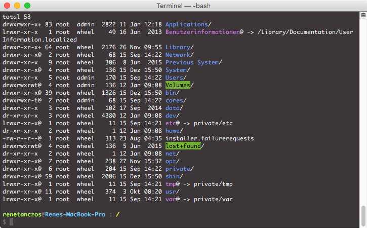

# mac-color-term

To get the same terminal style like on the image underneath, you have to follow this simple steps.

## 1. download this repo

## 2. Import the mac-color-term.terminal file into you terminal.

You can achieve that by open the terminal and go to the terminal preferences and select import.

## 3. To get the colorful letters exexute the following command

```
$ bash -c "$(curl -Ls https://github.com/gravmatt/mac-color-term/raw/master/install.sh)"
```

## 4. Star this project and follow me on twitter [@gravmatt](https://twitter.com/gravmatt)


